# PULSO · App Móvil (Android nativo)

App Android nativa construida en **Kotlin + Jetpack Compose** a partir del diseño de Figma "09 · Mockups Mobile" (Entrega 3), con el objetivo de poder generar un APK instalable.

**[⬇ Descargar APK release firmado](https://github.com/PulsoUXProject/pulsoMobileFront/releases/latest)** (ver [Releases](https://github.com/PulsoUXProject/pulsoMobileFront/releases))

Es una interfaz de alta fidelidad visual: los componentes con algún nivel de interacción (filtros, navegación entre pantallas) están activos y responden en pantalla, pero **no implementa lógica de negocio real** ni persiste datos — no hay backend ni base de datos detrás.

## Requisitos

- [Android Studio](https://developer.android.com/studio) (recomendado, gestiona el SDK y el Gradle wrapper automáticamente) — última versión estable.
- O bien, línea de comandos: JDK 17+ y el Android SDK (`compileSdk`/`targetSdk` 36, `minSdk` 26) con las variables `ANDROID_HOME`/`local.properties` configuradas.

## Abrir el proyecto

1. Abre Android Studio → **Open** → selecciona la carpeta `front_MobilePulso`.
2. Deja que Android Studio sincronice Gradle. Si pide descargar el SDK Platform 36 o el Build-Tools correspondiente, acepta la descarga (lo hace automáticamente).
3. Ejecuta la app con el botón ▶ Run sobre un emulador o dispositivo físico.

## Generar el APK desde línea de comandos

Desde la carpeta `front_MobilePulso`:

```bash
./gradlew assembleDebug
```

El APK queda en `app/build/outputs/apk/debug/app-debug.apk`, listo para instalar (`adb install app/build/outputs/apk/debug/app-debug.apk`).

Para una build de release (firmada):

```bash
./gradlew assembleRelease
```

El APK queda en `app/build/outputs/apk/release/app-release.apk`. La firma usa un keystore local (`keystore/pulso-release.jks`) generado para este proyecto; sus credenciales están en `keystore.properties` en la raíz del proyecto. **Ninguno de los dos archivos se sube a git** (están en `.gitignore`) — si clonas el repo en otra máquina sin esos archivos, `assembleRelease` compila igual pero el APK queda sin firmar.

## Estructura del proyecto

```
app/src/main/java/com/pulso/mobile/
  MainActivity.kt              Punto de entrada de la Activity
  ui/theme/                    Tokens de color, tipografía y MaterialTheme (extraídos del Figma)
  ui/navigation/                Rutas de navegación (Navigation Compose) y bottom nav
  ui/components/                Componentes reutilizables (barra superior, barra inferior)
  ui/screens/today/             M01, M02, M03, M04, M11, M12, M13, M14 Sin conexión y sincronización
  ui/screens/alarm/             M05 Permisos, M06 Estado, M07 Alerta contextual, M08 Expandida, M09 Nueva hora
  ui/screens/settings/          M15 · Preferencias de accesibilidad, M16 · Prueba de alerta (pestaña "Ajustes")
  ui/screens/calendar/          Calendario (adaptación móvil de la vista semanal del front web)
```

## Mapa de pantallas (Figma → app)

| Pantalla (Figma) | Estado |
|---|---|
| M01 · Hoy y pendientes | ✅ Implementada (`ui/screens/today/TodayScreen.kt`) |
| M02 · Captura rápida | ✅ Implementada (`ui/screens/today/QuickCaptureSheet.kt`, se abre desde el FAB; "Fecha y hora" usa `DatePickerDialog` + `TimePicker` de Material3, no texto libre) |
| M03 · Confirmación y error | ✅ Implementada (`ui/screens/today/ConfirmationScreen.kt`, resultado real de M02 — el error se dispara al elegir una fecha/hora anterior a "ahora") |
| M04 · Detalle del compromiso | ✅ Implementada (`ui/screens/today/DetailScreen.kt`, se abre al tocar una tarjeta en Hoy) |
| M05 · Permisos y canal | ✅ Implementada (`ui/screens/alarm/AlarmChannelScreen.kt`) |
| M06 · Estado de alarma | ✅ Implementada (`ui/screens/alarm/AlarmStatusScreen.kt`, resultado real de M05) |
| M07 · Alerta contextual | ✅ Implementada (`ui/screens/alarm/ContextualAlertOverlay.kt`, "AMPLIAR" abre M08) |
| M08 · Alerta expandida | ✅ Implementada (`ui/screens/alarm/AlertExpandedScreen.kt`, pantalla completa sin nav inferior) |
| M09 · Nueva fecha y hora | ✅ Implementada (`ui/screens/alarm/NewTimeScreen.kt`, "REPROGRAMAR" en M04/M07/M08 la abre) |
| M10 · Vencidos | ✅ Implementada — no es una pantalla aparte: es el filtro "Vencidos" de M01 (`TodayScreen.kt`), con encabezado, chips y footer propios |
| M11 · Compromiso en curso | ✅ Implementada (`ui/screens/today/InProgressScreen.kt`, se abre tocando el paso actual en M04; cuenta regresiva real y checklist interactivo) |
| M12 · Confirmar cierre | ✅ Implementada (`ui/screens/today/ConfirmCloseDialog.kt`, diálogo de "CONFIRMAR CUMPLIMIENTO" en M11) |
| M13 · Resultado y deshacer | ✅ Implementada (`ui/screens/today/ResultScreen.kt`, banda "DESHACER" real con ventana de 10 s) |
| M14 · Sin conexión y sincronización | ✅ Implementada (`ui/screens/today/SyncStatusScreen.kt`, ahora se abre desde el enlace "Estado" del top bar en toda la app) |
| M15 · Preferencias de accesibilidad | ✅ Implementada (`ui/screens/settings/AccessibilityScreen.kt`, es la pestaña "Ajustes" real) |
| M16 · Prueba de alerta | ✅ Implementada (`ui/screens/settings/TestAlertScreen.kt`, "VER ALERTA REAL" dispara M07 de verdad sobre Hoy) |

Fuente: [Figma · Entrega 3 · PULSO · Mockups Mobile](https://www.figma.com/design/kJgtYhtxKTru6gD7Xxj61s/Entrega-3-%C2%B7-PULSO-%C2%B7-Mockups-Mobile?node-id=1-3).

## Capturas de pantalla

Capturas tomadas en vivo sobre un emulador de Android Studio (Pixel, 1080×2400), con marco de dispositivo agregado para mostrar el contexto.

| Pantalla | Captura |
|---|---|
| M01 · Hoy y pendientes | 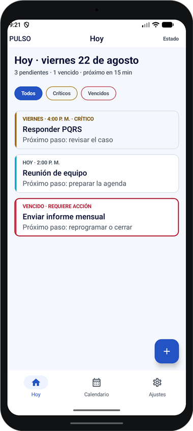 |
| M02 · Captura rápida | 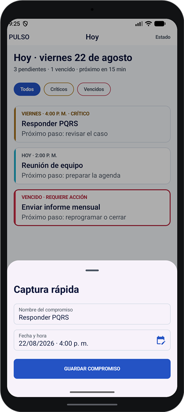 |
| M03 · Confirmación y error | 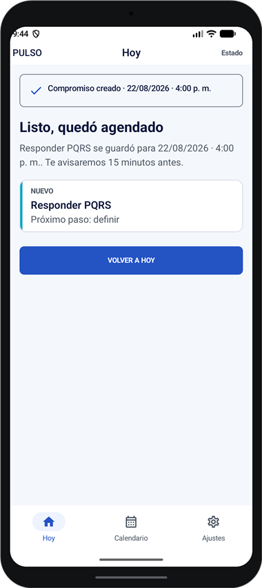 |
| M04 · Detalle del compromiso | 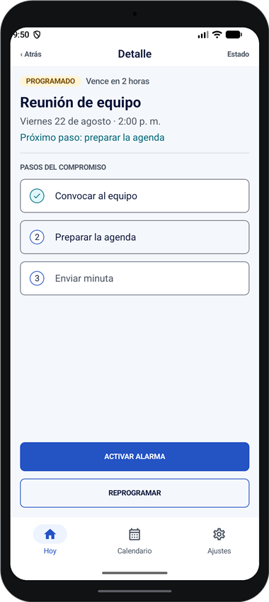 |
| M05 · Permisos y canal | 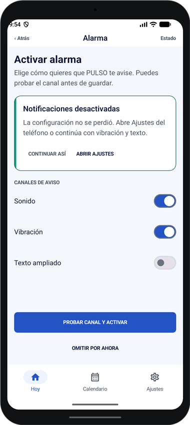 |
| M06 · Estado de alarma | 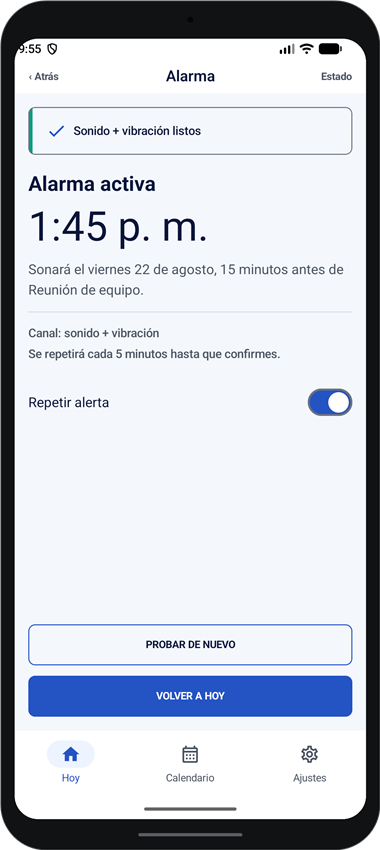 |
| M07 · Alerta contextual | 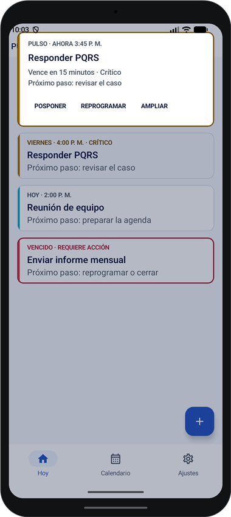 |
| M08 · Alerta expandida | 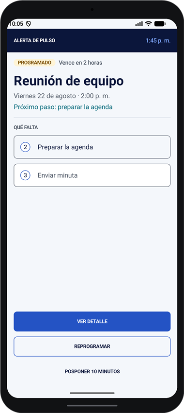 |
| M09 · Nueva fecha y hora | 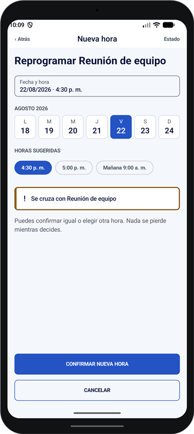 |
| M10 · Vencidos | 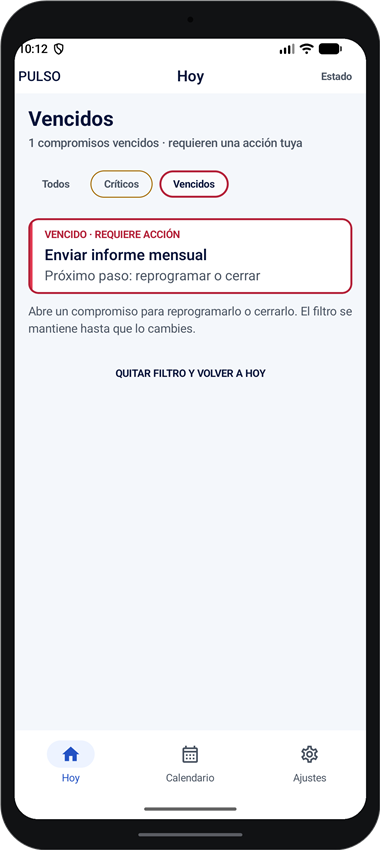 |
| M11 · Compromiso en curso | 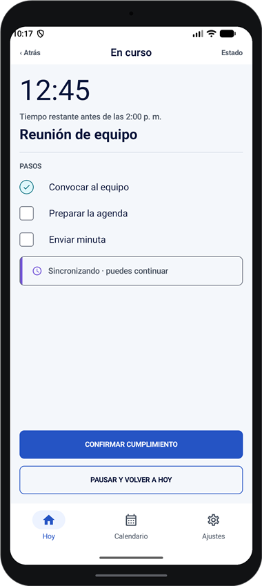 |
| M12 · Confirmar cierre | 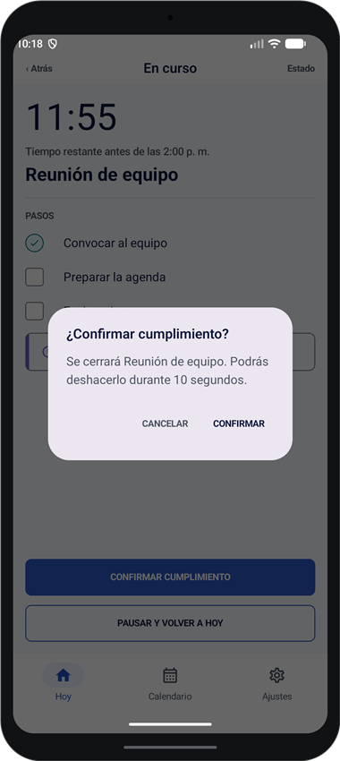 |
| M13 · Resultado y deshacer | 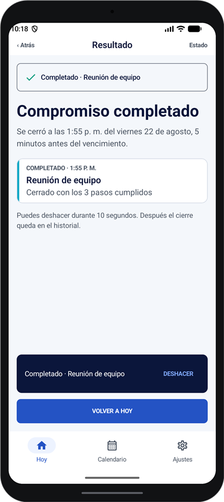 |
| M14 · Sin conexión y sincronización | 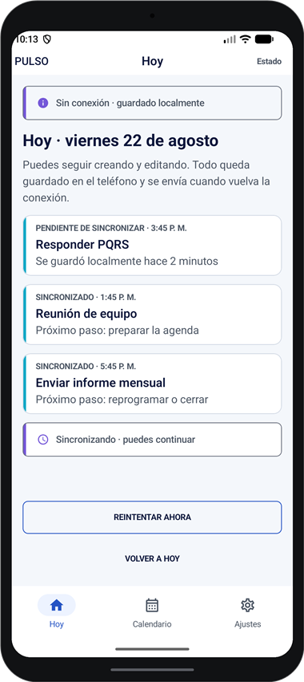 |
| M15 · Preferencias de accesibilidad | 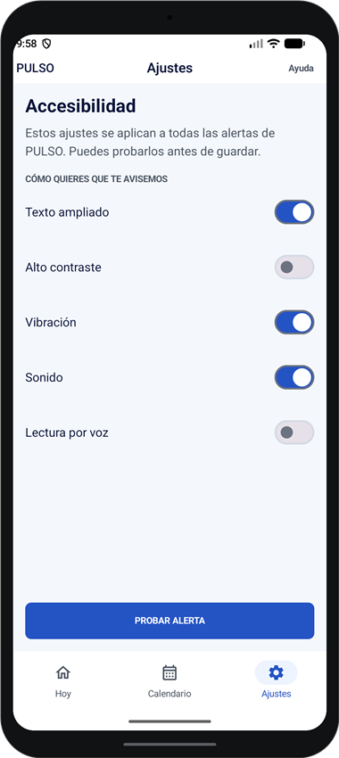 |
| M16 · Prueba de alerta | 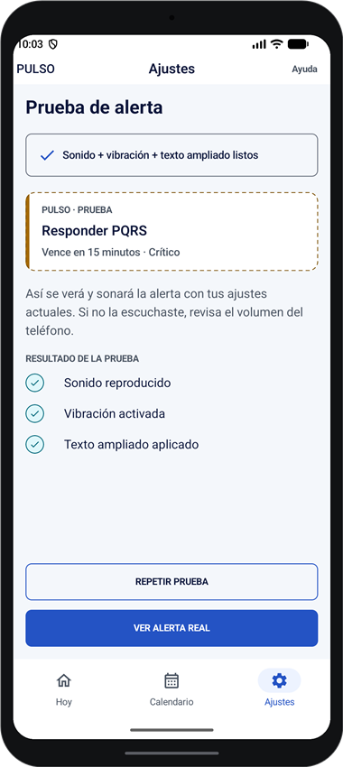 |
| Calendario (adaptado del front web) | 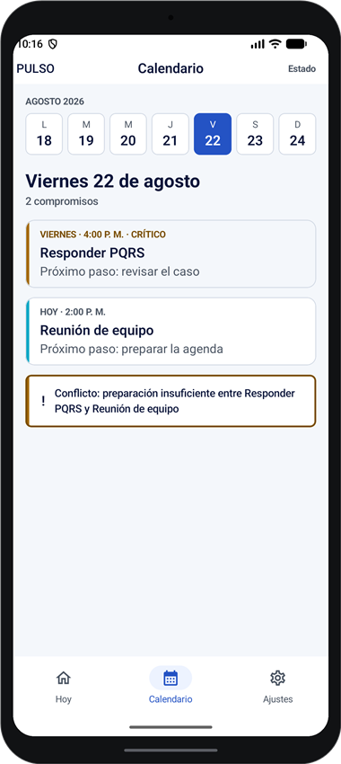 |

## Calendario (adaptado del front web)

La pestaña "Calendario" no tenía pantalla propia en el Figma móvil, así que se adaptó de la vista semanal de `front_webPulso` (`W07 · Calendario múltiple`): en vez de una grilla de 5 columnas lado a lado (no cabe en 360dp), la versión móvil usa una tira horizontal de días (L–D) + la agenda del día seleccionado, reutilizando `CommitmentCard` y el aviso de conflicto de horario. Implementada en `ui/screens/calendar/CalendarScreen.kt`.

## Stack técnico

- [Kotlin](https://kotlinlang.org/) 2.4.20
- [Jetpack Compose](https://developer.android.com/develop/ui/compose) (BOM 2026.03.00) + Material 3
- [Navigation Compose](https://developer.android.com/develop/ui/compose/navigation) para la navegación entre pantallas
- Gradle 8.14.3 + Android Gradle Plugin 8.13.2
- `compileSdk` / `targetSdk` 36, `minSdk` 26 (Android 8.0+)
